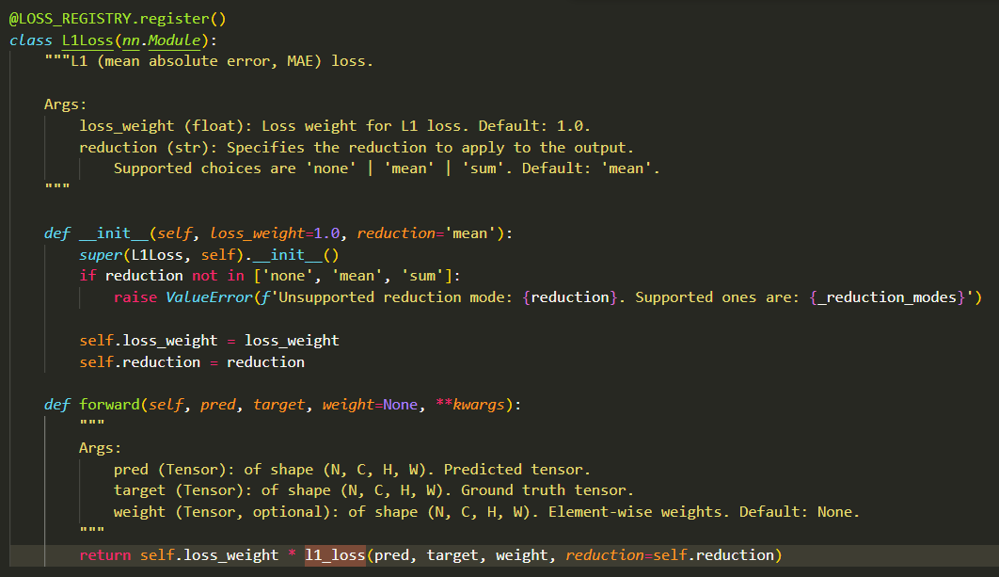

1. cuda版本切换成11.6，默认好像是11.3
  具体操作：
  ① vi switch-cuda.sh 将上述 Phohenecker 编写的脚本内容填入新建文件当中
  ② source switch-cuda.sh 执行脚本会扫描当前已安装的 cuda版本并显示在终端上
  ③ source switch-cuda.sh version . version 为须切换的CUDA版本号，脚本基于export 语句，重启终端后，cuda环境还是会恢复到原先版本
  source switch-cuda.sh 11.6
2. unset LD_LIBRARY_PATH，不然会报错
  报错信息：
  RuntimeError: CUDA error: CUBLAS_STATUS_INVALID_VALUE when calling cublasSgemmStridedBatched( handle, opa, opb, m, n, k, &alpha, a, lda, stridea, b, ldb, strideb, &beta, c, ldc, stridec, num_batches)

3. 为什么这里输入四个参数？

